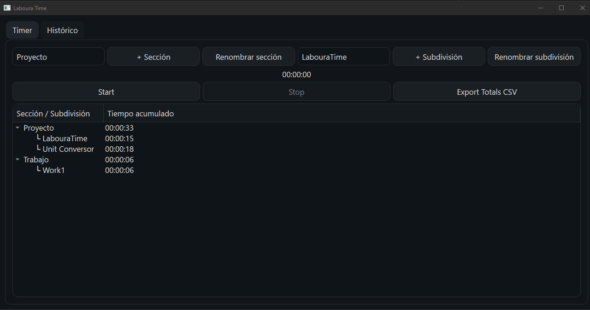
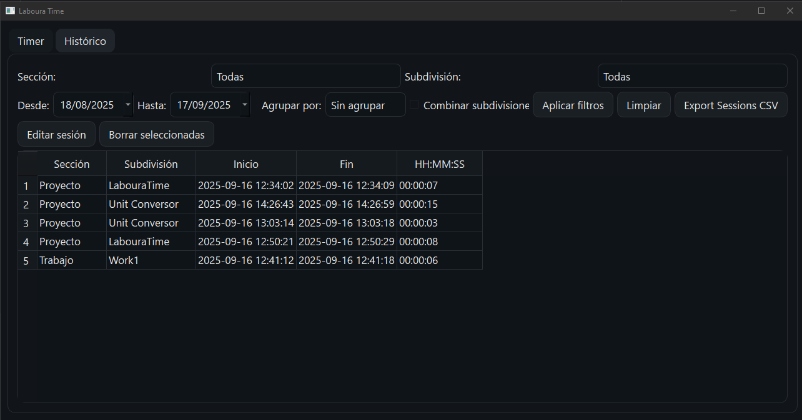
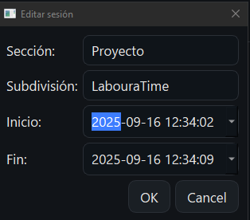

# ⏱️ Laboura Time

<p align="left">
  <a href="https://github.com/alexPacheco-code/Laboura-Time/releases">
    
  </a>
  <a href="LICENSE">
    
  </a>
  
  <a href="https://github.com/alexPacheco-code/Laboura-Time/stargazers">
    
  </a>
</p>

---

**Descarga para Windows:** [Último release](https://github.com/alexPacheco-code/Laboura-Time/releases/latest)

---

Aplicación de escritorio en **Python + PySide6 (Qt)** para cronometrar tiempo por **secciones** y **subdivisiones**, con histórico filtrable y exportación a CSV.  

## ✨ Funcionalidades
- Cronómetro por secciones y subdivisiones.  
- Histórico de sesiones con filtros por:
  - Rango de fechas
  - Sección y subdivisión
  - Agrupación (día / semana / mes)
- Edición y borrado de sesiones.  
- Exportación de:
  - Totales por sección/subdivisión → CSV  
  - Sesiones individuales → CSV  
- Tema oscuro moderno.  
- Persistencia automática en `data.json` (ignorado en el repositorio).  

---

## 🖥️ Capturas
<p align="center">
  <br>
  <em>Timer por secciones y subdivisiones</em>
</p>

<p align="center">
  <br>
  <em>Histórico con filtros y agrupación</em>
</p>

<p align="center">
  <br>
  <em>Diálogo para editar una sesión</em>
</p>

---

## 📦 Requisitos
- Python **3.10+** (recomendado 3.10 o 3.11)  
- Dependencias:  
  ```txt
  PySide6>=6.5

---

## 🔧 Installation

```bash
# 1) (opcional) crear y activar entorno virtual en Windows
python -m venv .venv
.venv\Scripts\activate

# 2) instalar dependencias
pip install -r requirements.txt
```

---

## ▶️ Run

```bash
python LabouraTime.py
```

---

## 📁 Project Structure

~~~text
Laboura-Time/
├─ LabouraTime.py
├─ requirements.txt
├─ README.md
├─ .gitignore
└─ docs/
   ├─ s1-timer.png
   ├─ s2-history.png
   └─ s3-edit-dialog.png
~~~

---

## ❓ Troubleshooting

- **No se instala PySide6**  
  Actualiza `pip` y reinstala dependencias:
  ~~~bash
  python -m pip install --upgrade pip
  pip install -r requirements.txt
  ~~~

- **La app no abre o se cierra al iniciar**  
  Comprueba la versión de Python (recomendado 3.12/3.13) y ejecuta desde terminal para ver el error:
  ~~~bash
  python LabouraTime.py
  ~~~

- **`git push` falla porque hay cambios en GitHub**  
  Trae primero y reubica tus commits:
  ~~~bash
  git pull --rebase origin main
  # si hay conflicto (p. ej., en README.md):
  # 1) abre el archivo y resuelve las marcas <<<<<<< ======= >>>>>>>
  # 2) guarda y continúa:
  git add README.md
  git rebase --continue
  git push
  ~~~

- **Subí `data.json` por error y quiero ignorarlo**  
  (Asegúrate de tener `data.json` en `.gitignore`)
  ~~~bash
  git rm --cached data.json
  git commit -m "chore: stop tracking data.json"
  git push
  ~~~


